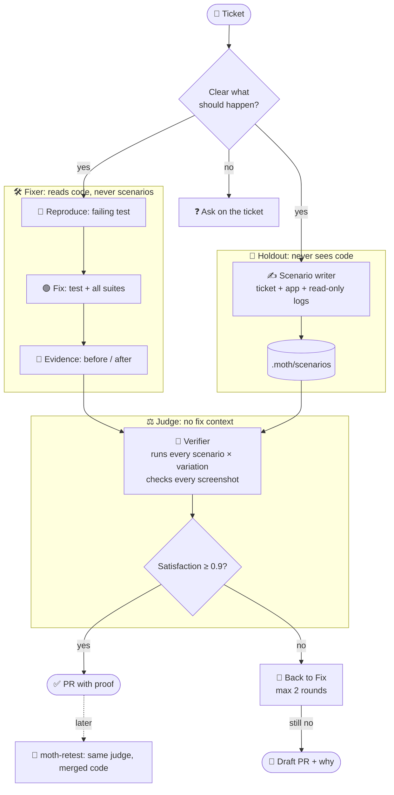

<p align="center">
  
</p>

# Moth

**Give it a bug ticket. Get back a PR with a fix and proof.**

A Claude Code plugin. It reproduces the bug, writes a failing test, fixes it, has an independent agent check the fix, and opens a PR with before/after screenshots.

## Start in 3 steps (~10 min)

1. Install once, from your project's root:
   ```bash
   claude plugin marketplace add RomanBarashcov/moth --scope project
   claude plugin install moth@moth --scope project
   ```
   `--scope project` shares Moth with your team via `.claude/settings.json`. Use `--scope user` for all your projects, `--scope local` for just you here.
2. Set it up:
   ```bash
   claude
   > /moth:moth-init
   ```
   It creates `.moth/`, adds it to `.gitignore`, and finds your repos, commands and tools. It asks only what it can't find. Commit the `.gitignore` line.
3. Fix one ticket:
   ```bash
   > /moth:moth-fix ACME-123
   ```

Update (from the project root): `claude plugin marketplace update moth`, then `claude plugin update moth@moth` and restart Claude Code. Coming from 0.2.x? Run `/moth:moth-init` once: it moves `system.yaml` and `knowledge/` into `.moth/` and asks before deleting the old `runs/` and `feedback/`. Hacking on Moth itself: `claude --plugin-dir .` from this repo.

Config example: [`examples/system.yaml`](examples/system.yaml).

## What you get in the PR

- 🔴→🟢 **A test** that fails before the fix and passes after it.
- 🎭 **A Playwright spec** you can re-run from the Playwright config's folder: `npx playwright test bugs/ACME-123 --headed`.
- 🖼️ **Before/after screenshots and GIFs** in the description.
- ⚖️ **Independent verification:** holdout scenarios, satisfaction score, judge notes.
- 🧭 **A short report:** verdict, confidence, what a human needs to check. The ticket gets a comment with the PR link.

You review. You merge. Moth never merges.

## How a run goes



| Step | What Moth does |
|---|---|
| 1. Intake | Reads the ticket. Skips it if git already has a fix. Asks on the ticket if expected behaviour is unclear. A separate agent writes holdout scenarios. |
| 2. Reproduce | Writes a failing test from the ticket, before reading the code. Stops after 3 tries. |
| 3. Fix | Makes the smallest change that turns the test green. Runs all tests. |
| 4. Proof | Runs the Playwright spec on the old code and the new code. |
| 5. Verify | An independent judge runs the holdout scenarios and scores satisfaction. Below 0.9 → back to step 3 (max 2 rounds). |
| 6. Record | Puts the run report in the PR (or on the ticket if it stopped), writes a knowledge note, deletes its temp files. |

## Why three agents

### The problem
- **AI copies the bugs it reads.** It writes new code from the code it sees, so a wrong pattern spreads.
- **A green test can lie.** The agent that writes the fix also writes the test. If it misread the bug, both are wrong and both pass.
- **Models grade their own work kindly.** An agent that knows what it meant to do sees that in the result.

### What Moth does
The work is split by **what each agent is not allowed to see**:

| Agent | Sees | Never sees | So that |
|---|---|---|---|
| 🛠️ Fixer | code, logs, ticket | the scenarios | it can't tune the fix to the check |
| 🙈 Scenario writer | ticket, running app, read-only logs | the code | it can't inherit the code's wrong assumptions |
| ⚖️ Judge | scenarios, running app, screenshots | the diff and the fixer's reasoning | it grades the result, not the intent |

- The scenarios have variations (other data, other order) and each runs 3 times. The fix passes at **≥ 0.9 satisfaction** per scenario.
- A passing test whose screenshot doesn't show the expected result counts as a fail.
- Not satisfied → back to Fix. After 2 rounds → draft PR that says why.
- *What should happen* comes only from the ticket. If the ticket doesn't say, Moth asks there instead of guessing.

### Why this works
It's an old rule, *the one who builds doesn't sign off*, applied to agents:
- **Developer and QA:** test cases come from the requirements, not the code.
- **Holdout set in ML:** you never score a model on data it trained on.
- **Evaluator-optimizer** ([Anthropic, *Building effective agents*](https://www.anthropic.com/engineering/building-effective-agents)): one agent builds, another grades and sends it back.
- **Holdout scenarios** from StrongDM's "dark factory" approach to code no human reads.

### Trade-offs
- 💸 **Cost:** 3 agents plus scenarios × variations × repeats. Overkill for a typo.
- 🧠 **Same model, shared blind spots:** all three can be wrong the same way. A different model for the judge would help.
- 🔓 **Soft isolation:** the guard hook blocks reads of `.moth/scenarios/`, but it checks command text; it isn't a sandbox.
- 📏 **Unmeasured:** there's no metric yet for how often the judge catches what the tests missed.

## Retest after the fix

```bash
> /moth:moth-retest ACME-123
```

Re-runs the bug's test and Playwright spec on the merged code (or the open PR) and the full test suites, then reports with fresh screenshots:

- ✅ **works**, ❌ **broken** (with the first error), or ⚠️ **inconclusive** (with what's missing).
- The exact commit it checked, so the proof can't go stale silently.
- Runs the independent judge on the holdout scenarios, and writes them first if there are none.
- Works for human fixes too: no spec, so it writes a throwaway one from the ticket.

The report shows up in the chat. Add `--post` to put it on the ticket, `--on <branch|sha|PR#>` to pick the code.

## Safety rules

**Blocked by a hook** (`hooks/guard.py`), not by trust:
- ❌ No push to `main`/`master`. No force push. No merge.
- ❌ No writes to staging or prod. Read-only logs and errors only.
- 🙈 Only the scenario writer and the judge can open `.moth/scenarios/`, including via `grep -r` or `find`.
- 🔒 If the hook itself breaks, it blocks the command.

**Limits in the skills:**
- 📝 Draft PR if the fix touches more than 10 files, a migration, or a public API.
- ⏱️ Stops after ~45 min or 3 failed reproduce tries, and comments what it found.

Test the hook: `python3 -m unittest discover -s hooks`

⚠️ The hook is a safety net, not a sandbox. Give Moth read-only credentials for prod data first.

## Where things live

```
your-project/
  .gitignore     ← one line: .moth/
  .moth/         ← all of Moth's files, never committed
    system.yaml    repos, commands, tools, rules
    guard.json     safety rules for the hook
    knowledge/     one note per fixed bug
    scenarios/     holdout scenarios, one folder per ticket
```

That's all. Test output and media live in a temp dir during a run and are deleted after it. The proof is in the PR, where reviewers look.

Several repos? Run Moth from one of them and list the others in `system.yaml` (`path: ../web-app`). Monorepo? `moth-init` records each app's `playwright_config`, and Moth runs Playwright from that folder.

Screenshots go to a separate `moth-evidence` branch. It is never merged, so no images end up in your code.

## Plugins that help

`moth-init` checks for these and gives install commands:

- A tracker: the `linear` or `atlassian` plugin, any other tracker MCP, or `gh` for GitHub issues
- `playwright`: screenshots and videos
- `superpowers`: TDD and debugging
- Sentry, Axiom or Grafana MCP: read-only logs and errors
- `ffmpeg`: GIFs in PRs (optional)

## The name

> In 1947, engineers found a moth stuck in Relay #70, Panel F of the Harvard Mark II computer: the panel behind the moth in the banner. They taped it into the logbook as the *"first actual case of bug being found"*. Every Moth run is logged too.

## What's next

| Phase | What | Status |
|---|---|---|
| 1 | Ticket → PR | ✅ now |
| 1.5 | Run unattended from a label queue (`claude -p`) | next |
| 2 | Hunt bugs on a schedule, file tickets itself | later |
| 3 | CLI and UI for teams | later |

## License

[MIT](LICENSE)
