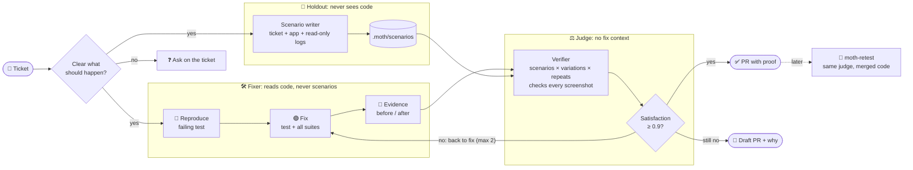

<p align="center">
  
</p>

# Moth

**Give it a bug ticket. Get back a PR with a fix and proof.**

A Claude Code plugin. It reproduces the bug, writes a failing test, fixes it, has an independent agent check the fix, and opens a PR with before/after screenshots.

## Start in 3 steps (~10 min)

1. Install once, from your project's root:
   ```bash
   claude plugin marketplace add RomanBarashcov/moth --scope project
   claude plugin install moth@moth --scope project
   ```
   `--scope project` shares Moth with your team via `.claude/settings.json`. Use `--scope user` for all your projects, `--scope local` for just you here.
2. Set it up:
   ```bash
   claude
   > /moth:moth-init
   ```
   It creates `.moth/`, adds it to `.gitignore`, and finds your repos, commands and tools. It asks only what it can't find. Commit the `.gitignore` line.
3. Fix one ticket:
   ```bash
   > /moth:moth-fix ACME-123
   ```

Update: `claude plugin marketplace update moth`, then `claude plugin update moth@moth` and restart Claude Code. Hacking on Moth itself: `claude --plugin-dir .` from this repo.

Config example: [`examples/system.yaml`](examples/system.yaml).

## What you get in the PR

- 🔴→🟢 **A test** that fails before the fix and passes after it.
- 🎭 **A Playwright spec** you can re-run: `npx playwright test bugs/ACME-123.spec.ts --headed`.
- 🖼️ **Before/after screenshots and GIFs** in the description.
- ⚖️ **Independent verification:** holdout scenarios, satisfaction score, judge notes.
- 🧭 **A short report:** verdict, confidence, what a human needs to check.
- 🔗 **A comment on the ticket** with the PR link.

You review. You merge. Moth never merges.

## How Moth proves a fix

The agent that fixes a bug also writes its test, so a green test alone can fool itself. Moth adds two checks it can't fake:

- 🙈 **Holdout scenarios.** A separate agent writes acceptance scenarios with variations to `.moth/scenarios/<TICKET-ID>/`. It works from the ticket and never reads the code. If the ticket is thin, it looks at the running app and read-only errors and logs to fill in the steps. *What should happen* still comes only from the ticket; if that's missing, Moth asks on the ticket. The fixer never sees the scenarios.
- ⚖️ **An independent judge.** Another agent, with no fix context, runs those scenarios against the fix, scores satisfaction over repeated runs, and looks at every screenshot. A passing test whose screenshot doesn't show the ticket's expected result counts as a fail.

If the judge isn't satisfied, Moth goes back to fixing. After 2 rounds it opens a draft PR and says why. Retest runs the judge too.

## Retest after the fix

```bash
> /moth:moth-retest ACME-123
```

Re-runs the bug's test and Playwright spec on the merged code (or the open PR) and the full test suites, then reports with fresh screenshots:

- ✅ **works**, ❌ **broken** (with the first error), or ⚠️ **inconclusive** (with what's missing).
- The exact commit it checked, so the proof can't go stale silently.
- Runs the independent judge on the holdout scenarios, and writes them first if there are none.
- Works for human fixes too: no spec, so it writes a throwaway one from the ticket.

The report shows up in the chat. Add `--post` to put it on the ticket, `--on <branch|sha|PR#>` to pick the code.

## How a run goes



| Step | What Moth does |
|---|---|
| 1. Intake | Reads the ticket. Skips it if git already has a fix. Asks on the ticket if expected behaviour is unclear. A separate agent writes holdout scenarios. |
| 2. Reproduce | Writes a failing test from the ticket, before reading the code. Stops after 3 tries. |
| 3. Fix | Makes the smallest change that turns the test green. Runs all tests. |
| 4. Proof | Runs the Playwright spec on the old code and the new code. |
| 5. Verify | An independent judge runs the holdout scenarios and scores satisfaction. Below 0.9 → back to step 3 (max 2 rounds). |
| 6. Record | Puts the run report in the PR (or on the ticket if it stopped), writes a knowledge note, deletes its temp files. |

## Safety rules

Enforced by a hook (`hooks/guard.py`), not by trust:

- ❌ No push to `main`/`master`. No force push. No merge.
- ❌ No writes to staging or prod. Read-only logs and errors only.
- 🙈 Only the scenario writer and the judge can open `.moth/scenarios/`. The fixer is blocked from reading it, including by `grep -r` or `find` over the project.
- 📝 Draft PR if the fix touches more than 10 files, a migration, or a public API.
- ⏱️ Stops after ~45 min or 3 failed reproduce tries, and comments what it found.
- 🔒 If the hook itself breaks, it blocks the command.

Test the hook: `python3 -m unittest discover -s hooks`

⚠️ The hook is a safety net, not a sandbox. Give Moth read-only credentials for prod data first.

## Where things live

```
your-project/
  .gitignore     ← one line: .moth/
  .moth/         ← all of Moth's files, never committed
    system.yaml    repos, commands, tools, rules
    guard.json     safety rules for the hook
    knowledge/     one note per fixed bug
    scenarios/     holdout scenarios, one folder per ticket
```

That's all. Test output and media live in a temp dir during a run and are deleted after it. The proof is in the PR, where reviewers look.

Several repos? Run Moth from one of them and list the others in `system.yaml` (`path: ../web-app`).

Screenshots go to a separate `moth-evidence` branch. It is never merged, so no images end up in your code.

## Plugins that help

`moth-init` checks for these and gives install commands:

- `linear` or `atlassian`: read tickets
- `playwright`: screenshots and videos
- `superpowers`: TDD and debugging
- Sentry, Axiom or Grafana MCP: read-only logs and errors
- `ffmpeg`: GIFs in PRs (optional)

## Why it exists

AI writes code from the code it sees. If that code has bugs, AI copies them. Moth breaks the loop: every bug gets a test, a fix and a note, so the next session sees the right pattern.

> **The name:** in 1947, engineers found a moth stuck in the Harvard Mark II computer. They taped it into the logbook as the *"first actual case of bug being found"*. Every Moth run is logged too.

## What's next

| Phase | What | Status |
|---|---|---|
| 1 | Ticket → PR | ✅ now |
| 1.5 | Run unattended from a label queue (`claude -p`) | next |
| 2 | Hunt bugs on a schedule, file tickets itself | later |
| 3 | CLI and UI for teams | later |

## License

[MIT](LICENSE)
